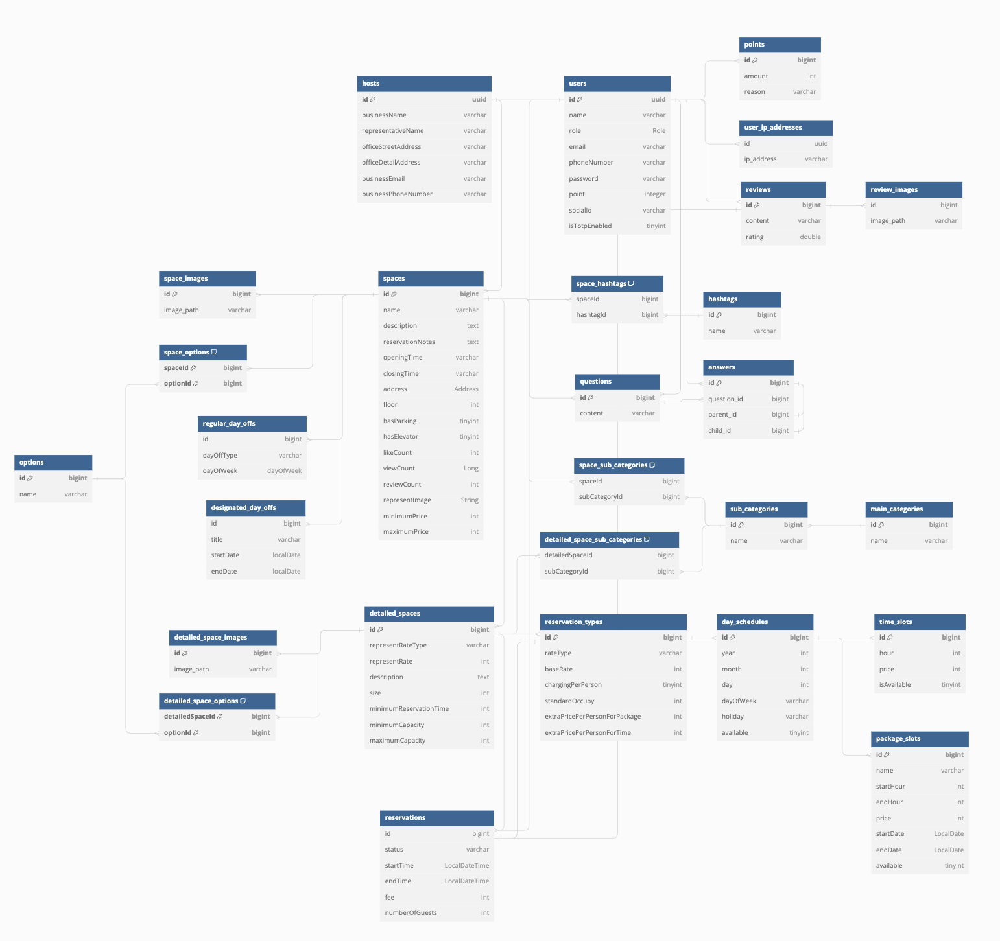

# Service

# Team
- Baeckend - [지준혁](https://github.com/ji-jjang)
- Frontend - [이진복](https://github.com/jinbokk) 

# Tech Stack
 
     
   
  

# ERD & Swagger

- [ERD](https://dbdiagram.io/d/SpaceStory-66a37cec8b4bb5230e6efe9c)
- [Swagger](https://spacestory.duckdns.org/swagger-ui/index.html)

# Architecture
